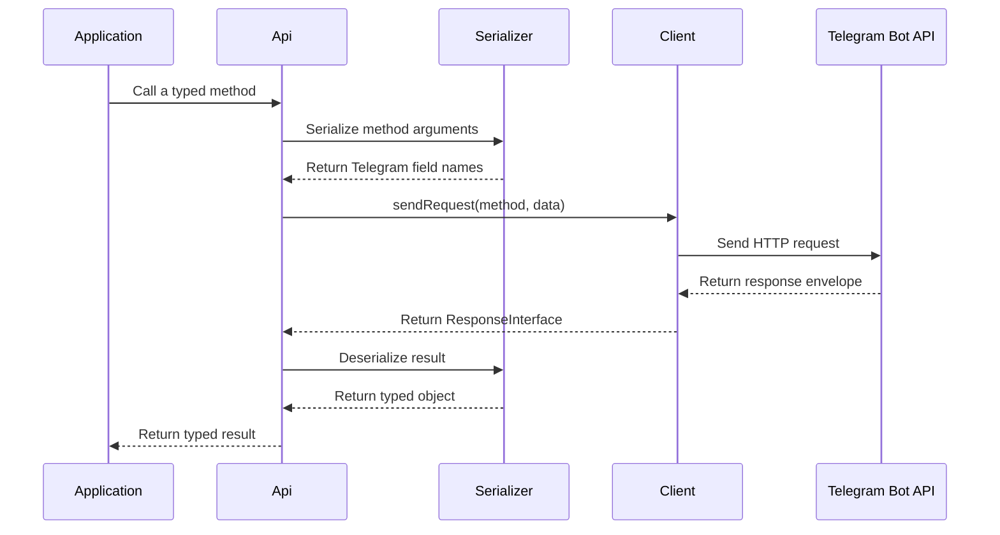

[Русский](../ru/architecture.md) | **English**

# Architecture

Phenogram Bindings separates the Telegram schema from the HTTP transport.
This separation keeps the runtime package small.
It also lets an application select its own HTTP stack.

## Request and response flow



The failure path stops before result deserialization.
`Api` throws `ResponseException` when `ok` is `false` or `result` is `null`.

## API layer

`ApiInterface` defines the supported Telegram methods.
Each method uses PHP parameter types.
Each method also has a typed return value.

`Api` implements the interface.
It collects the method arguments.
It sends the serialized data to `ClientInterface`.
It deserializes the Telegram `result` value.

Use `ApiInterface` as an application dependency when practical.
This choice makes API substitution easier in tests.

## Client layer

`ClientInterface` is the transport boundary.
The package does not provide a production implementation.

A client has two responsibilities:

1. Send the method and serialized data to Telegram.
2. Return a `ResponseInterface` for the decoded response envelope.

The client must keep `InputFileInterface` objects intact until it creates multipart data.
The serializer does not convert these objects to arrays.

Read [Client integration](client-integration.md) for the complete contract.

## Serializer layer

`SerializerInterface` defines three operations:

| Operation | Purpose |
|---|---|
| `serialize()` | Convert API arguments to Telegram field names and values |
| `deserialize()` | Convert decoded result data to a target type |
| `supports()` | Check whether a target type is supported |

`Serializer` uses these rules during serialization:

- Change `camelCase` keys to `snake_case`.
- Remove values that are `null`.
- Convert `TypeInterface` objects to arrays.
- Keep `InputFileInterface` objects unchanged.
- Apply the same rules to nested arrays.

`Serializer` uses `FactoryInterface` during deserialization.
It selects a concrete type for each Telegram interface.
It also selects concrete variants for Telegram union types.

## Factory layer

`FactoryInterface` defines object construction.
`Factory` creates the standard package types.

Replace the factory when your application needs custom result types.
Pass the custom factory to the serializer.

Run the verified example:

```bash
php examples/04-custom-type.php
```

The public type interfaces use [PHP property hooks](https://www.php.net/manual/en/language.oop5.property-hooks.php).
The hooks let an implementation change property behavior.

## Type layer

The `src/Types` directory contains two public forms of each Telegram type:

- A concrete class such as `User`.
- An interface such as `UserInterface`.

Prefer interfaces in application boundaries.
Use concrete classes for direct construction when no replacement is required.

Optional Telegram fields use nullable PHP properties.
Telegram can omit these fields.
Check a nullable property before you use it.

Telegram identifiers can exceed 32 bits.
Run the package on a 64-bit PHP build.

## Test factories

The `src/Factories` directory contains fixture factories.
These classes create concrete Telegram objects.
They use Faker for values that you do not provide.

An application does not install library development dependencies.
Install Faker in an application that uses the factories:

```bash
composer require --dev fakerphp/faker
```

Do not use these factories as a production data source.
Specify each asserted value to keep a test deterministic.

Run the verified example:

```bash
php examples/05-test-factories.php
```

## Generated code

Most Telegram schema files are generated from the official documentation.
The [`phenogram/scraper`](https://github.com/phenogram/scraper) repository contains the generation tool.

Treat the [official Telegram Bot API documentation](https://core.telegram.org/bots/api) as the behavior source.
Treat generated interfaces as the package contract.
Update the generator when a schema change affects many generated files.

## Explicit non-goals

This package does not provide these components:

- HTTP connection management
- Bot token storage
- Long-polling loop management
- Webhook server management
- Routing and middleware
- Retry and rate-limit policy
- Logging

Use [Phenogram Framework](https://github.com/phenogram/framework) when you need these runtime components.
