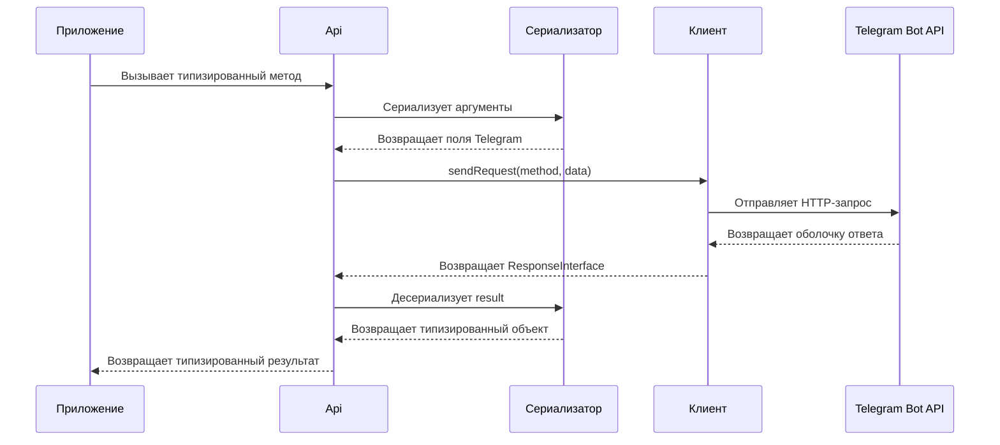

**Русский** | [English](../en/architecture.md)

# Архитектура

Phenogram Bindings отделяет схему Telegram от HTTP-транспорта.
Такое разделение сохраняет малый размер рабочего пакета.
Оно также позволяет приложению выбрать HTTP-стек.

## Поток запроса и ответа



При ошибке десериализация результата не выполняется.
`Api` выбрасывает `ResponseException`, если `ok` равно `false` или `result` равно `null`.

## Слой API

`ApiInterface` определяет поддерживаемые методы Telegram.
Каждый метод использует типы параметров PHP.
Каждый метод также имеет типизированное возвращаемое значение.

`Api` реализует этот интерфейс.
Он собирает аргументы метода.
Он передаёт сериализованные данные в `ClientInterface`.
Он десериализует значение `result` из ответа Telegram.

По возможности используйте `ApiInterface` как зависимость приложения.
Так API проще заменить в тестах.

## Слой клиента

`ClientInterface` является границей транспорта.
Пакет не предоставляет рабочую реализацию.

У клиента есть две обязанности:

1. Отправить метод и сериализованные данные в Telegram.
2. Вернуть `ResponseInterface` для декодированной оболочки ответа.

Клиент должен сохранять объекты `InputFileInterface` до создания multipart-данных.
Сериализатор не преобразует эти объекты в массивы.

Полный контракт описан в [руководстве по интеграции клиента](client-integration.md).

## Слой сериализатора

`SerializerInterface` определяет три операции:

| Операция | Назначение |
|---|---|
| `serialize()` | Преобразует аргументы API в имена и значения полей Telegram |
| `deserialize()` | Преобразует декодированный результат в целевой тип |
| `supports()` | Проверяет поддержку целевого типа |

`Serializer` применяет следующие правила при сериализации:

- Заменяет ключи `camelCase` на `snake_case`.
- Удаляет значения `null`.
- Преобразует объекты `TypeInterface` в массивы.
- Сохраняет объекты `InputFileInterface` без изменений.
- Применяет те же правила к вложенным массивам.

При десериализации `Serializer` использует `FactoryInterface`.
Он выбирает конкретный тип для каждого интерфейса Telegram.
Он также выбирает конкретные варианты для union-типов Telegram.

## Слой фабрики

`FactoryInterface` определяет создание объектов.
`Factory` создаёт стандартные типы пакета.

Замените фабрику, если приложению нужны свои типы результата.
Передайте свою фабрику в сериализатор.

Запустите проверенный пример:

```bash
php examples/04-custom-type.php
```

Публичные интерфейсы типов используют [property hooks из PHP](https://www.php.net/manual/ru/language.oop5.property-hooks.php).
Hooks позволяют реализации изменить поведение свойства.

## Слой типов

Каталог `src/Types` содержит две публичные формы каждого типа Telegram:

- Конкретный класс, например `User`.
- Интерфейс, например `UserInterface`.

Используйте интерфейсы на границах приложения.
Используйте конкретные классы для прямого создания объектов.

Необязательные поля Telegram представлены nullable-свойствами PHP.
Telegram может не передать эти поля.
Проверяйте nullable-свойство перед использованием.

Идентификаторы Telegram могут не помещаться в 32 бита.
Запускайте пакет на 64-битной сборке PHP.

## Тестовые фабрики

Каталог `src/Factories` содержит фабрики фикстур.
Эти классы создают конкретные объекты Telegram.
Они используют Faker для значений, которые вы не передали.

Приложение не устанавливает зависимости разработки библиотеки.
Установите Faker в приложение, которое использует фабрики:

```bash
composer require --dev fakerphp/faker
```

Не используйте эти фабрики как источник рабочих данных.
Укажите каждое проверяемое значение, чтобы тест был детерминированным.

Запустите проверенный пример:

```bash
php examples/05-test-factories.php
```

## Сгенерированный код

Большая часть файлов схемы Telegram генерируется из официальной документации.
Репозиторий [`phenogram/scraper`](https://github.com/phenogram/scraper) содержит инструмент генерации.

Считайте [официальную документацию Telegram Bot API](https://core.telegram.org/bots/api) источником поведения.
Считайте сгенерированные интерфейсы контрактом пакета.
Обновляйте генератор, если изменение схемы затрагивает много сгенерированных файлов.

## Явные ограничения

Этот пакет не предоставляет следующие компоненты:

- Управление HTTP-соединениями
- Хранение токена бота
- Управление циклом long polling
- Управление сервером webhook
- Маршруты и middleware
- Политику повторов и ограничений частоты
- Логирование

Используйте [Phenogram Framework](https://github.com/phenogram/framework), если нужны эти компоненты среды выполнения.
